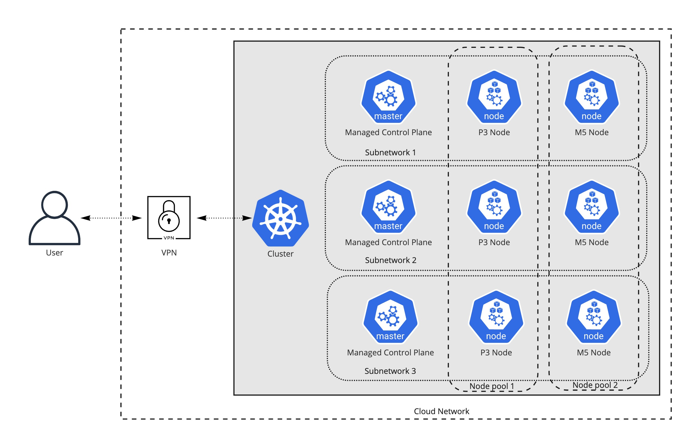

<h1>
    
    Fury GKE Installer
</h1>

<!-- <KFD-DOCS> -->

**Fury GKE Installer** deploys a production-grade Kubernetes Fury cluster based on Google Kubernetes Engine (GKE).

If you are new to Kubernetes Fury please refer to the [official documentation][kfd-docs] on how to get started.

## Modules

The installer is composed of the following terraform modules:

|            Module             |                  Description                   |
| ----------------------------- | ---------------------------------------------- |
| [VPC][vpc-module] | Deploy the necessary networking infrastructure |
| [VPN][vpn-module]             | Deploy a VPN Server to connect to private clusters
| [GKE][gke-module]             | Deploy the GKE cluster                         |

Click on each module to see its full documentation.

## Architecture

The GKE installers deploys and configures a production-ready GKE cluster without having to learn all internals of the service.

The [GKE module][gke-module] deploys a **private control plane** cluster, where the control plane endpoint is not publicly accessible.

The [VPC module][vpc-module] setups all the necessary networking infrastructure. The [VPN module][vpn-module] setups one or more bastion hosts with an OpenVPN server.

The bastion host includes a OpenVPN instance easily manageable by using [furyagent][furyagent] to provide access to the cluster.

> 🕵🏻‍♂️ [Furyagent][furyagent] is a tool developed by SIGHUP to manage OpenVPN and SSH user access to the bastion host.

## Usage

### Requirements

- **GCP Access Credentials** of a GCP Account with `Project Owner` role with the following APIs enabled:
  - *Identity and Access Management (IAM) API*
  - *Compute Engine API*
  - *Cloud Resource Manager API*
  - *Kubernetes Engine API*
- **terraform** `>=1.3.0`
- `ssh` or **OpenVPN Client** - [Tunnelblick][tunnelblick] (on macOS) or [OpenVPN Connect][openvpn-connect] (for other OS) are recommended.

### Create GKE Cluster

To create the cluster via the installers:

1. Use the [VPC module][vpc-module] to deploy the networking infrastructure

2. Use the [VPN module][vpn-module] to deploy the OpenVPN bastion host

3. Configure access to the OpenVPN instance of the bastion host via [furyagent][furyagent]

4. Connect to the OpenVPN instance

5. Use the [GKE module][gke-module] to deploy the GKE cluster

Please refer to each module documentation and the [examples](examples/) folder for more details.

> You can follow the [Fury on GKE quick start guide][fury-gke-quickstart] for a more detailed walkthrough

<!-- Links -->

[vpc-module]: https://github.com/sighupio/fury-gke-installer/tree/master/modules/vpc
[vpn-module]: https://github.com/sighupio/fury-gke-installer/tree/master/modules/vpn
[gke-module]: https://github.com/sighupio/fury-gke-installer/tree/master/modules/gke
[kfd-docs]: https://docs.kubernetesfury.com/docs/distribution/

[furyagent]: https://github.com/sighupio/furyagent
[tunnelblick]: https://tunnelblick.net/downloads.html
[openvpn-connect]: https://openvpn.net/vpn-client/
[fury-gke-quickstart]: https://github.com/sighupio/fury-getting-started/blob/main/legacy/fury-on-gke/

<!-- </KFD-DOCS> -->
<!-- <FOOTER> -->

## Contributing

Before contributing, please read first the [Contributing Guidelines](docs/CONTRIBUTING.md).

### Reporting Issues

In case you experience any problem with the module, please [open a new issue](https://github.com/sighupio/fury-kubernetes-networking/issues/new/choose).

## License

This module is open-source and it's released under the following [LICENSE](LICENSE)

<!-- </FOOTER> -->
